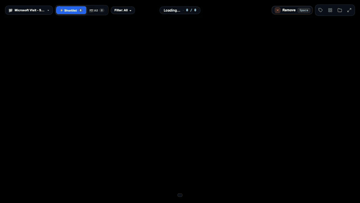

# ⚡ Speed Culler – High-Speed Photo Culler & Post Categorizer

An ultra-fast, zero-lag tool designed for photographers, social media managers, and event organizers to quickly cull, shortlist, and categorize thousands of high-resolution event photos in seconds.



*Watch the high-resolution [MP4 Demo Video](demo.mp4).*

---

## 💡 Why SpeedCuller? (The Problem with Existing Tools)

If you've ever covered a hackathon, conference, or photo shoot and had to cull **1,000+ raw 24MP DSLR photos** from an external SSD for social media, you know the frustration:

| Tool | The Limitation |
| :--- | :--- |
| **Adobe Lightroom / Capture One** | Heavy bloatware. Importing 1,000+ raw files and building previews takes 20–30 minutes before you can start. Expensive subscription. Doesn't physically sort photos into disk folders without complex export presets. |
| **Photo Mechanic** | The industry gold standard for sports culling, but costs **$149+**, has a steep 90s enterprise interface, and lacks a zero-friction web UI tailored for multi-post social media campaigns. |
| **DigiKam / Darktable / FastStone** | Rely purely on metadata/XMP tags (star ratings). They don't physically organize your files into structured subfolders on disk upon a single keystroke. |
| **Mac Finder / Preview** | Lags and stutters when paging through 1,000+ high-res photos on external drives. No single-key categorization, no dual-mode (Master vs Shortlist), and no instant 2.5x cursor-centered face zoom. |
| **Immich / Photoprism** | Incredible self-hosted libraries, but require full Docker, PostgreSQL, and Redis setups just to cull an event sprint. |

### How SpeedCuller is Different:
1. **Physical File Organization on Disk**: Pressing `1` doesn't just add a metadata tag; it physically copies the photo into `/Volumes/C/Selected/<Event>/Categories/1_General/` in milliseconds. Ready to drag directly into Canva, Figma, or Instagram.
2. **Zero-Lag Image Preloading**: Preloads the next 5 photos into memory so swiping with `→` feels instant (120Hz smooth) even over external USB drives.
3. **Double-Click 2.5x Face Focus Zoom**: Photographers need to check if eyes and faces in group shots are sharp. Double-clicking instantly zooms 2.5x right where your cursor is placed.
4. **Zero Dependencies**: Pure Python 3 standard library. No `pip install`, no Docker, no databases. Runs with a single command: `./start.sh`.

---

## 🚀 Quick Start (Zero Setup Required)

No external libraries or `pip install` commands needed. Speed Culler runs on pure Python 3 standard library.

### 1. Launch Server & UI
Run the 1-click startup script:
```bash
./start.sh
```
Or run directly with Python:
```bash
python3 server.py
```

### 2. Open in Browser
Visit **[http://127.0.0.1:5500](http://127.0.0.1:5500)** in Google Chrome, Microsoft Edge, or Safari.

---

## 📂 Standardized Folder Hierarchy

Speed Culler keeps all original camera files completely untouched and organizes your shortlists automatically under:

```text
/Volumes/C/Selected/
└── [Project_Name]/   (e.g., "Microsoft Visit - SVIET Impact AI Ideathon")
      ├── Overall_Selected/   <-- All shortlisted photos (one single clean folder)
      ├── Categories/         <-- Subfolders for each category:
      │     ├── 1_General/
      │     ├── 2_Quiz/
      │     ├── 3_Judges/
      │     ├── 4_Awards/
      │     ├── 5_Mentors/
      │     ├── 6_Other/
      │     └── 7_Prizes/
      └── Removed/            <-- Safe trash for photos removed from shortlist
```

---

## ⌨️ Keyboard Shortcuts Cheat Sheet

| Shortcut | Action |
| :--- | :--- |
| **`Space`** | **Toggle Shortlist** (Add to `Overall_Selected` or move to `Removed`) |
| **`1` – `7` (or `N`)** | **Assign Category** (Copies to category folder + auto-adds to shortlist) |
| **`0` / `Backspace`** | **Unassign Category** |
| **`M`** | **Switch Source View** (Toggle between Shortlist vs All Camera Photos) |
| **`→` / `D`** | Next Photo |
| **`←` / `A`** | Previous Photo |
| **Double Click** | **2.5x Face Zoom** centered directly on cursor position |
| **Scroll Wheel** | Smooth zoom in / out (up to 8x) |
| **Click & Drag** | Pan around zoomed photo |
| **`G`** | **Grid View** (Full-screen thumbnail matrix with category filters) |
| **`F`** | Fullscreen toggle |
| **`O`** | **Open Folder** in macOS Finder (`/Volumes/C/Selected/<Project_Name>`) |
| **`Esc`** | Clear active filter / Reset zoom / Close modals |

---

## 📁 Multi-Project & Custom Category Features

### 1. Project Switcher (Top-Left Bar)
- Switch between different events/photo sessions with a single click.
- Click **`+ Add Folder / Project...`** to add any photo directory.
- Auto-detects camera folders on `/Volumes/C` for 1-click project setup.

### 2. Custom Categories ("🏷️ Categories" Button)
- Define custom categories for any project (e.g. Hackathon, Wedding, Corporate, Portrait).
- Includes one-click presets:
  - **Event / Hackathon**: `General, Quiz, Judges, Awards, Mentors, Other, Prizes`
  - **Wedding / Shoot**: `Couple, Family, Guests, Rituals, Candid, Stage`
  - **Quick Cull**: `Selects, Maybe, Review`
- Add new categories on the fly anytime; corresponding subfolders are created instantly on disk.

---

## 🛠️ Project Structure

```text
~/Documents/SpeedCuller/
├── server.py        # Lightweight backend server (ThreadingHTTPServer)
├── projects.json    # Project registry and category configurations
├── index.html       # High-performance single-page frontend application
├── start.sh         # Executable 1-click startup script
├── requirements.txt # Dependency specifications (Standard Library only)
└── README.md        # Documentation and user manual
```

---

## 🔒 Data Safety & Integrity
- **Originals are Never Touched**: Camera files in source directories are strictly read-only.
- **Safe Trash**: Photos unselected via `Space` are safely moved to `Removed/` rather than deleted, so you can easily restore them at any time.
